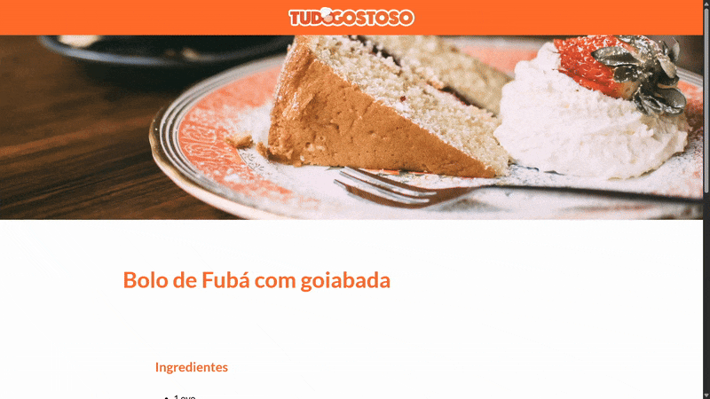

# Páginas de Receitas

> Nesse projeto foi desenvolvido uma página contendo uma receita de bolo, usado como referencia o site https://www.tudogostoso.com.br/ (Projeto desenvolvido no curso Programador BR)

### Tecnologias usadas

O projeto utiliza as seguintes tecnologias:

- HTML
- CSS

## 📝 Licença

Esse projeto está sob licença. Veja o arquivo [LICENÇA](LICENSE) para mais detalhes.
